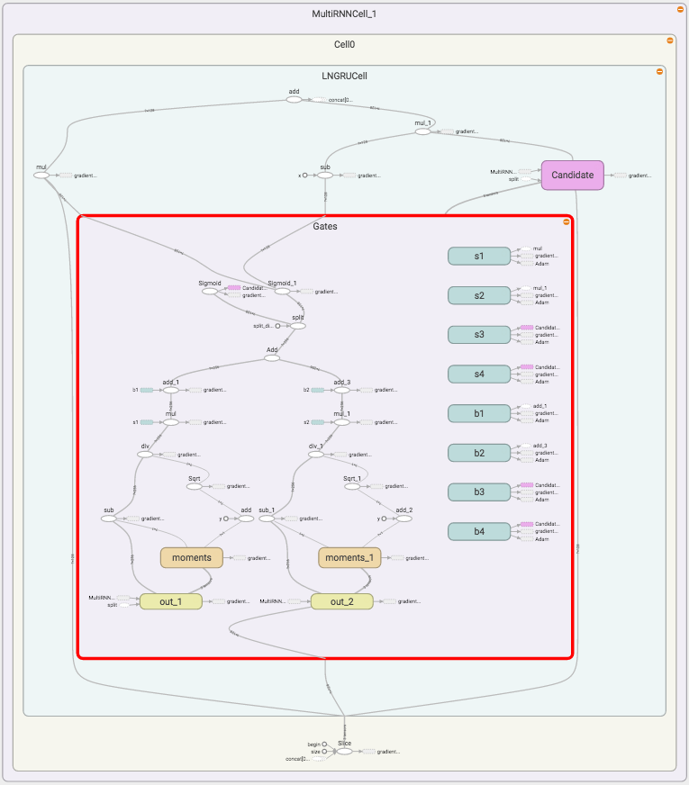
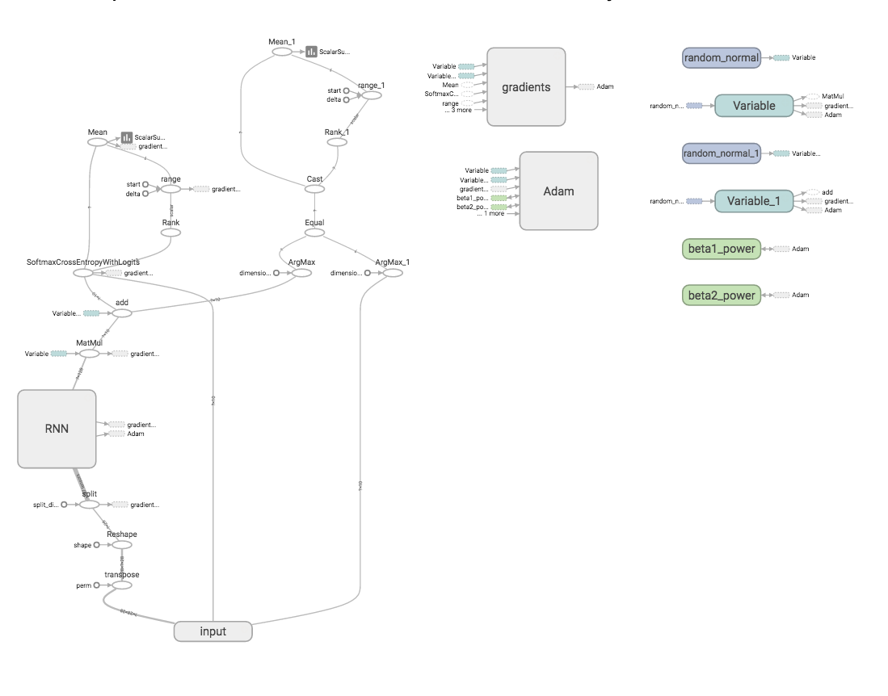

# Tensorflow Layer Normalization and Hyper Networks
=================================
Tensorflow implementation of [Layer Normalization](https://arxiv.org/abs/1607.06450) and [Hyper Networks](https://arxiv.org/pdf/1609.09106v1.pdf).

This implementation contains:

1. Layer Normalization for GRU
    
2. Layer Normalization for LSTM
	- Currently normalizing c causes lot of nan's in the model, thus commenting it out for now.

3. Hyper Networks for LSTM

4. Layer Normalization and Hyper Networks (combined) for LSTM

Prerequisites
-------------

- Python 2.7 or Python 3.3+
- [NLTK](http://www.nltk.org/)
- [TensorFlow](https://www.tensorflow.org/) >= 0.9

MNIST
-----
To evaluate the new model, we train it on MNIST. Here is the model and results using Layer Normalized GRU

Usage
-----

To train a mnist model with different cell_types:

    $ python mnist.py --hidden 128 summaries_dir log/ --cell_type LNGRU

To train a mnist model with HyperLSTM:

    $ python mnist.py --hidden 128 summaries_dir log/ --cell_type HyperLnLSTMCell --layer_norm 0

To train a mnist model with HyperLSTM and Layer Normalization:
    $ python mnist.py --hidden 128 summaries_dir log/ --cell_type HyperLnLSTMCell --layer_norm 1

    
 cell_type = [LNGRU, LNLSTM, LSTM , GRU, BasicRNN,LNLSTM]
    

To view graph:

    $ tensorboard --logdir log/train/

Todo
-----
1. Add attention based models ( in progress ). 
